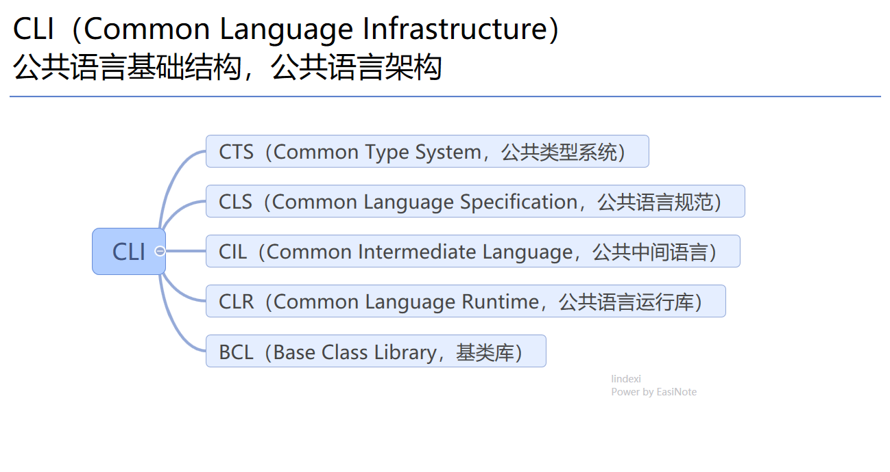
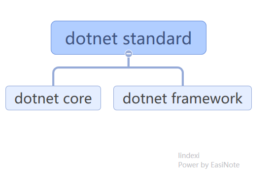
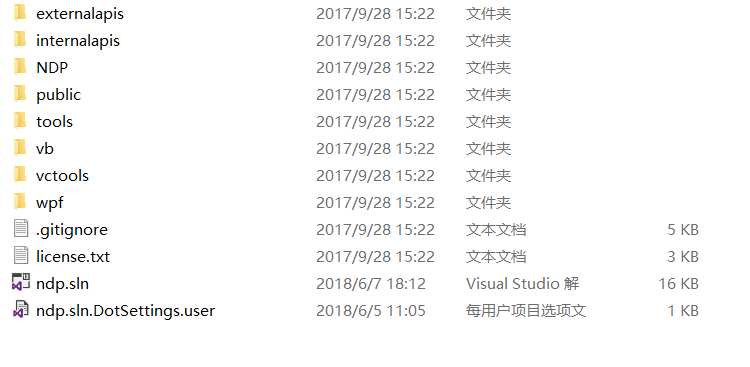
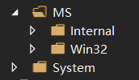

# 手把手教你读 dotnet framework 源代码

本文告诉大家如何阅读 dotnet framework 源代码。本金鱼技术有限，如果发现有什么地方没写到，欢迎告诉我

<!--more-->

<!-- csdn -->
<!-- 标签：C#,dotnet-framework,源代码分析 -->

<!-- 草稿 -->

因为 dotnet framework 是比较难的，所以本文不适合刚接触 dotnet 的大佬。

微软定义了规范CLI（Common Language Infrastructure）公共语言基础结构，公共语言架构，对他的实现就是 dotnet framework，而 CLI 包含了很多规范，请看下图

<!--  -->

实现 CLI 的 dotnet framework 包含两个部分

<!--  -->

现在微软准备跨平台，所以存在 dotnet standard 包含微软制定 API ，和 dotnet framework 的关系请看下图

<!--  -->

需要知道 dotnet framework 是不开源的，dotnet core 是开源的，但是可以通过反编译和从微软 https://referencesource.microsoft.com/ 拿到源代码

因为 https://referencesource.microsoft.com/ 网站的速度太慢，如果需要下载 dotnet framework 源代码，请点击 下载

<!--  -->

开放的 dotnet framework 源代码是无法下载就可以编译通过，如果需要编译通过需要做很多修改。

现在我通过反编译让部分的 WPF 代码可以编译通过，如果你需要可以联系我

把源代码解压，可以看到如下图的文件

<!--  -->

双击打开 ndp.sln 就可以看到 VisualStudio 很多工程，下面我来告诉大家工程的意思

## 类库

### System 

System 命名空间包含基本类和基类，这些类定义常用的值和引用数据类型、事件和事件处理程序、接口、属性和异常处理。

### System.Activities 

System.Activities 命名空间包含在 Window Workflow Foundation 中创建和处理活动所需要的所有类。

### System.AddIn 

System.AddIn 命名空间包含具有以下用途的类型：确定、注册、激活和控制加载项，允许加载项与主机应用程序进行通信。

### System.CodeDom 

System.CodeDom 命名空间包含具有以下功能的类：代表源代码文档的元素，支持生成用被支持的编程语言编写的源代码并进行编译。

### System.Collections 

System.Collections 命名空间包含具有以下功能的类型：定义各种标准的、专门的、通用的集合对象。

### System.ComponentModel 

System.ComponentModel 命名空间包含具有以下功能的类型：实现组件和控件的运行时和设计时行为。子命名空间支持 Managed Extensibility Framework (MEF)，提供用于为 ASP.NET 动态数据控件定义元数据的特性类，包含用于定义组件及其用户界面的设计时行为的类型。

### System.Configuration 

System.Configuration 命名空间包含具有以下用途的类型：处理配置数据，如计算机或应用程序配置文件中的数据。子命名空间包含具有以下用途的类型：配置程序集，编写组件的自定义安装程序，支持用于在客户端和服务器应用程序中添加或删除功能的可插入模型。

### System.Data 

System.Data 包含具有以下用途的类：访问和管理多种不同来源的数据。顶层命名空间和许多子命名空间一起形成 ADO.NET 体系结构和 ADO.NET 数据提供程序。例如，提供程序可用于 SQL Server、Oracle、ODBC 和 OleDB。其他子命名空间包含由 ADO.NET 实体数据模型 (EDM) 和 WCF 数据服务使用的类。

### System.Deployment 

System.Deployment 命名空间包含具有以下功能的类型：支持部署 ClickOnce 应用程序。
System.

### Device.Location 

System.Device.Location 命名空间使应用程序开发人员可通过使用一个 API 方便地访问计算机的位置。位置信息可能来自多个提供程序，例如 GPS、Wi-Fi 三角测量和移动电话塔三角测量。 System.Device.Location 类提供一个 API，用于在一台计算机上封装多个位置提供程序，并支持在这些提供程序之间无缝地区分优先级和转换。 因此，使用此 API 的应用程序开发人员不需要定制应用程序特定的硬件配置。

### System.Diagnostics 

System.Diagnostics 命名空间包含具有以下功能的类型：能让您与系统进程、事件日志和性能计数器之间进行交互。子命名空间包含具有以下功能的类型：与代码分析工具进行交互，支持协定，扩展对应用程序监控和检测的设计时支持，使用 Windows 事件跟踪 (ETW) 跟踪子系统来记录事件数据，在事件日志中进行读取和写入，收集性能数据，以及读取和写入调试符号信息。

### System.DirectoryServices 

System.DirectoryServices 命名空间包含具有以下功能的类型：能让您通过托管代码访问 Active Directory。

### System.Drawing 

System.Drawing 父命名空间包含具有以下功能的类型：支持基本的 GDI+ 图形功能。子命名空间支持高级二维和矢量图形功能、高级成像功能，以及与打印有关的服务和排印服务。另外，子命名空间还包含具有以下功能的类型：扩展设计时用户界面逻辑和绘图。

### System.Dynamic 

System.Dynamic 命名空间提供支持动态语言运行时的类和接口。

### System.EnterpriseServices 

System.EnterpriseServices 命名空间包含具有以下功能的类型：定义 COM+ 服务体系结构，从而为企业应用程序提供基础结构。子命名空间支持补偿资源管理器 (CRM)，这是一个 COM+ 服务，允许将非事务性对象包含在 Microsoft 分布式事务协调程序 (DTC) 事务中。子命名空间在下表中有简要介绍，在此参考中有详细记录。

### System.Globalization 

System.Globalization 命名空间包含定义区域性相关信息的类，这些信息包括语言，国家/地区，正在使用的日历，日期、货币和数字的格式模式，以及字符串的排序顺序。 这些类对于编写全球化（国际化）应用程序很有用。 而像 StringInfo 和 TextInfo 这样的类更是为我们提供了诸如代理项支持和文本元素处理等高级全球化功能。

### System.IdentityModel 

System.IdentityModel 命名空间包含用于为 .NET 应用程序提供身份验证和授权的类型。

### System.IO 

System.IO 命名空间包含具有以下功能的类型：支持输入和输出，包括以同步或异步方式在流中读取和写入数据、压缩流中的数据、创建和使用独立存储区、将文件映射到应用程序的逻辑地址空间、将多个数据对象存储在一个容器中、使用匿名或命名管道进行通信、实现自定义日志记录，以及处理出入串行端口的数据流。

### System.Linq 

System.Linq 命名空间包含具有以下功能的类型：支持使用语言集成查询 (LINQ) 的查询。这包括具有以下功能的类型：代表查询成为表达式树中的对象。

### System.Management 

System.Management 命名空间包含具有以下功能的类型：能让您访问有关系统、设备和应用程序的管理信息和管理事件（纳入 Windows Management Instrumentation (WMI) 基础结构中）。另外，这些命名空间还包含检测应用程序所需的类型，可使检测应用程序将其管理信息和事件通过 WMI 展示给潜在的客户。

### System.Media 

System.Media 命名空间包含用于播放声音文件和访问系统提供的声音的类。

### System.Messaging 

System.Messaging 命名空间包含具有以下功能的类型：能让您连接、监控和管理网络上的消息队列，以及发送、接收或查看消息。子命名空间包含具有以下用途的类：扩展对消息类的设计时支持。

### System.Net 

System.Net 命名空间包含具有以下功能的类型：提供适用于许多网络协议的简单编程接口，以编程方式访问和更新 System.Net 命名空间的配置设置，定义 Web 资源的缓存策略，撰写和发送电子邮件，代表多用途 Internet 邮件交换 (MIME) 标头，访问网络流量数据和网络地址信息，以及访问对等网络功能。另外，其他子命名空间还能让您以受控方式实现 Windows 套接字 (Winsock) 接口，能让您访问网络流以实现主机之间的安全通信。

### System.Numerics 

包含补充由 .NET Framework 定义的数值基元（例如 Byte、Double 和 Int32）的数值类型的 System.Numerics 命名空间。

### System.Printing 

System.Printing 命名空间包含具有以下功能的类型：支持打印，允许访问打印系统对象的属性，允许将其属性设置快速复制到另一个相同类型的对象，支持受控 System.PrintTicket 对象和非受控 GDI DEVMODE 结构的相互转换。

### System.Reflection 

System.Reflection 命名空间包含具有以下功能的类型：能让您以受控方式查看加载的类型、方法和字段，能够动态创建和调用类型。子命名空间包含具有以下功能的类型：能让编译器或其他工具发出元数据和 Microsoft 中间语言 (MSIL)。

### System.Resources 

System.Resources 命名空间包含具有以下功能的类型：能让开发人员创建、存储和管理应用程序的区域性特定资源。

### System.Runtime 

System.Runtime 命名空间包含具有以下功能的类型：支持应用程序与公共语言运行时的交互，支持应用程序数据缓存、高级异常处理、应用程序域内的应用程序激活、COM 互操作、分布式应用程序、序列化和反序列化，以及版本控制等功能。另外，其他子命名空间还能让编译器编写人员指定特性来影响公共语言运行时的运行时行为，在一组代码和其他依赖它的代码之间定义可靠性协定，以及实现 Windows Communication Foundation (WCF) 的持久性提供程序。

### System.Security 

System.Security 命名空间包含具有以下功能的类：代表 .NET Framework 安全性系统和权限。子命名空间提供具有以下功能的类型：控制对安全对象的访问并进行审核，允许进行身份验证，提供加密服务，根据策略控制对操作和资源的访问，以及支持应用程序创建的内容的权限管理。

### System.ServiceModel 

System.ServiceModel 命名空间包含生成 Windows Communication Foundation (WCF) 服务和客户端应用程序所需要的类型。

### System.ServiceProcess 

System.ServiceProcess 命名空间包含具有以下功能的类型：能让您实现、安装和控制 Windows 服务应用程序，扩展对 Windows 服务应用程序的设计时支持。

### System.Speech 

System.Speech 命名空间包含支持语音识别的类型。

### System.Text 

System.Text 命名空间包含用于字符编码和字符串操作的类型。还有一个子命名空间能让您使用正则表达式来处理文本。

### System.Threading 

System.Threading 命名空间包含启用多线程编程的类型。还有一个子命名空间提供可简化并发和异步代码编写工作的类型。

### System.Timers 

System.Timers 命名空间提供 Timer 组件，它使您可以在指定的间隔是引发事件。

### System.Transactions 

System.Transactions 命名空间包含具有以下功能的类型：支持具有多个分布式参与者、多个阶段通知和持久登记的事务。还有一个子命名空间包含具有以下功能的类型：描述 System.Transactions 使用的配置选项。

### System.Web 

System.Web 命名空间包含启用浏览器/服务器通信的类型。子命名空间包含具有以下功能的类型：支持 ASP.NET 窗体身份验证、应用程序服务、服务器上的数据缓存、ASP.NET 应用程序配置、动态数据、HTTP 处理程序、JSON 序列化、将 AJAX 功能并入 ASP.NET, ASP.NET 安全性中，以及 Web 服务。

### System.Windows 

System.Windows 命名空间包含在 Windows Presentation Foundation (WPF) 应用程序中使用的类型，包括动画客户端、用户界面控件、数据绑定和类型转换。System.Windows.Forms 及其子命名空间用于开发 Windows 窗体应用程序。

### System.Workflow 

System.Workflow 命名空间包含具有以下用途的类型：开发使用 Windows Workflow Foundation 的应用程序。这些类型为规则和活动提供设计时和运行时支持，以便配置、控制、托管和调试工作流运行时引擎。

### System.Xaml 

System.Xaml 命名空间包含具有以下功能的类型：支持解析和处理可扩展应用程序标记语言 (XAML)。

### System.Xml 

System.Xml 命名空间包含用于处理 XML 的类型。子命名空间支持 XML 文档或流的序列化、XSD 架构、XQuery 1.0 和 XPath 2.0，以及 LINQ to XML（这是一个内存中 XML 编程接口，方便修改 XML 文档）。

### Accessibility 

Accessibility 及其公开的所有成员都属于组件对象模型 (COM) 辅助功能接口的托管包装的一部分。

### Microsoft.Activities 

Microsoft.Activities 命名空间包含支持针对 Windows Workflow Foundation 应用程序的 MSBuild 和调试器扩展的类型。
Microsoft.

### Aspnet.Snapin 

Microsoft.Aspnet.Snapin 命名空间定义了 ASP.NET 管理控制台应用程序与 Microsoft 管理控制台 (MMC) 交互所需的类型。 有关更多信息，请参见 MSDN Library 中的“MMC Programmer's Guide”（MMC 程序员指南）。

### Microsoft.Build 

Microsoft.Build 命名空间包含具有以下功能的类型：以编程方式访问和控制 MSBuild 引擎。

### Microsoft.CSharp 

Microsoft.CSharp 命名空间包含具有以下功能的类型：支持生成和编译用 C# 语言编写的源代码，支持动态语言运行时 (DLR) 和 C# 之间进行互操作。
Microsoft.Data.Entity.

### Build.Tasks 

Microsoft.Data.Entity.Build.Tasks 命名空间包含由 ADO.NET 实体数据模型设计器（实体设计器）所使用的两项 MSBuild 任务。

### Microsoft.JScript 

Microsoft.JScript 命名空间包含具有以下功能的类：支持用 JScript 语言生成代码和进行编译。
Microsoft.

### SqlServer.Server 

Microsoft.SqlServer.Server 命名空间包含将 Microsoft .NET Framework 公共语言运行时 (CLR) 集成到 Microsoft SQL Server 和 SQL Server 数据库引擎进程执行环境时所要用到的类、接口和枚举。

### Microsoft.VisualBasic 

Microsoft.VisualBasic 命名空间包含具有以下功能的类：支持用 Visual Basic 语言生成代码和进行编译。子命名空间包含具有以下功能的类型：为 Visual Basic 编译器提供服务，支持 Visual Basic 应用程序模型、My 命名空间、lambda 表达式和代码转换。

### Microsoft.VisualC 

Microsoft.VisualC 命名空间包含具有以下功能的类型：支持 Visual C++ 编译器，实现 STL/CLR 库和 STL/CLR 库通用接口。

### Microsoft.Win32 

Microsoft.Win32 命名空间提供具有以下功能的类型：处理操作系统引发的事件，操纵系统注册表，代表文件和操作系统句柄。

### Microsoft.Windows 

Microsoft.Windows 命名空间包含支持 Windows Presentation Framework (WPF) 应用程序中的主题和预览的类型。

### UIAutomationClientsideProviders 

包含单个映射客户端自动化提供程序的类型。

### XamlGeneratedNamespace 

包含不用于从代码中直接使用的编译器生成的类型

## WPF 类库

在很多 WPF 类库，都有相似的文件

<!--  -->

文件夹里包含 MS 文件夹和 System 文件夹，

这里的 MS 文件夹包含的很多都是和 Windows 系统相关的底层代码也就是COM的包装，而 System 包含的是对系统上一层的代码，也就是应用程序的代码。

 本作品采用<a rel="license" href="http://creativecommons.org/licenses/by-nc-sa/4.0/">知识共享署名-非商业性使用-相同方式共享 4.0 国际许可协议</a>进行许可。欢迎转载、使用、重新发布，但务必保留文章署名[林德熙](http://blog.csdn.net/lindexi_gd)(包含链接:http://blog.csdn.net/lindexi_gd )，不得用于商业目的，基于本文修改后的作品务必以相同的许可发布。如有任何疑问，请与我[联系](mailto:lindexi_gd@163.com)。